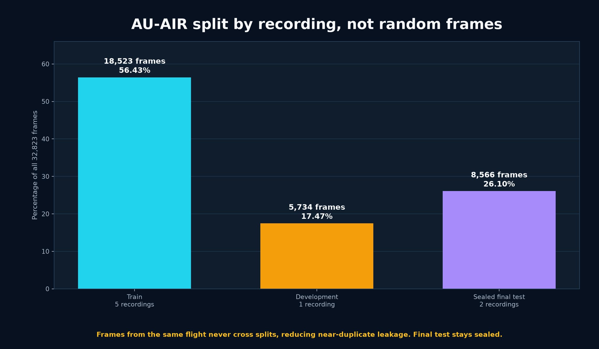
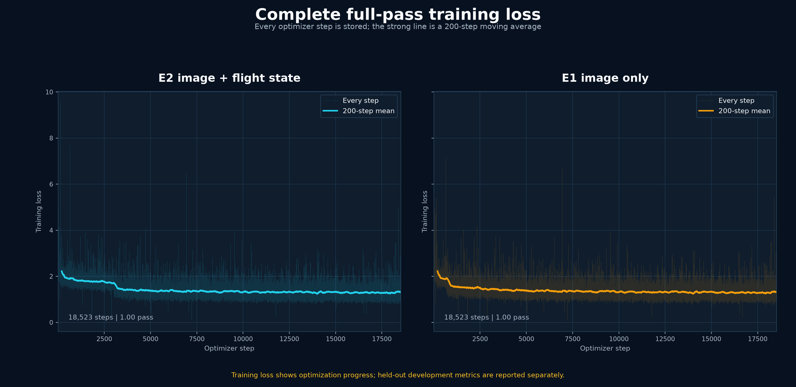
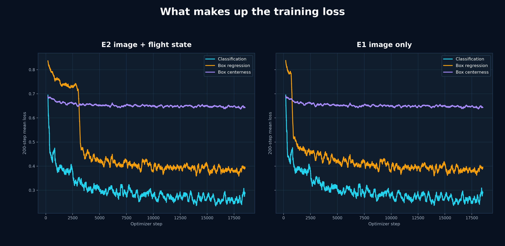
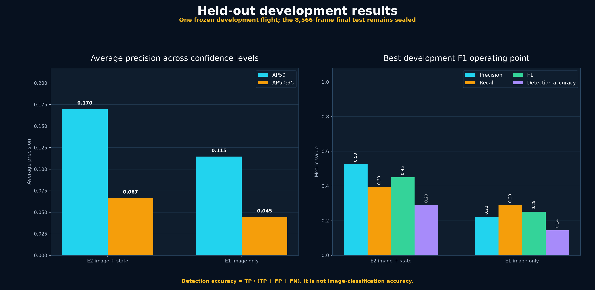
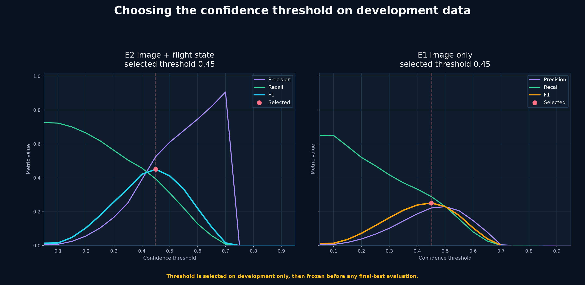
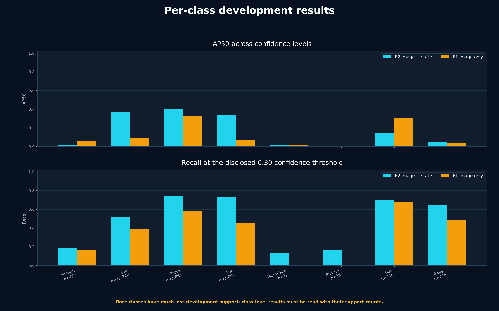
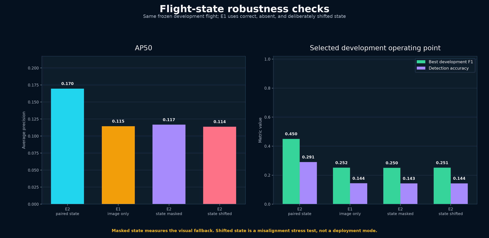
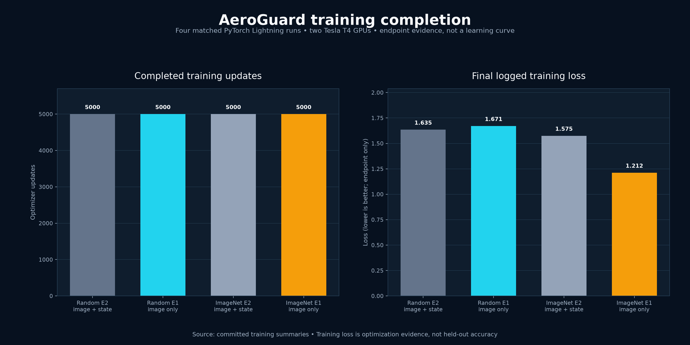
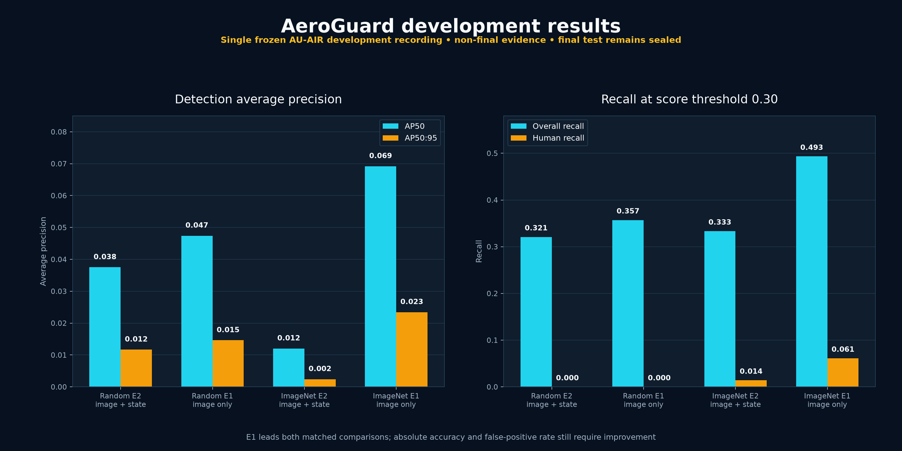
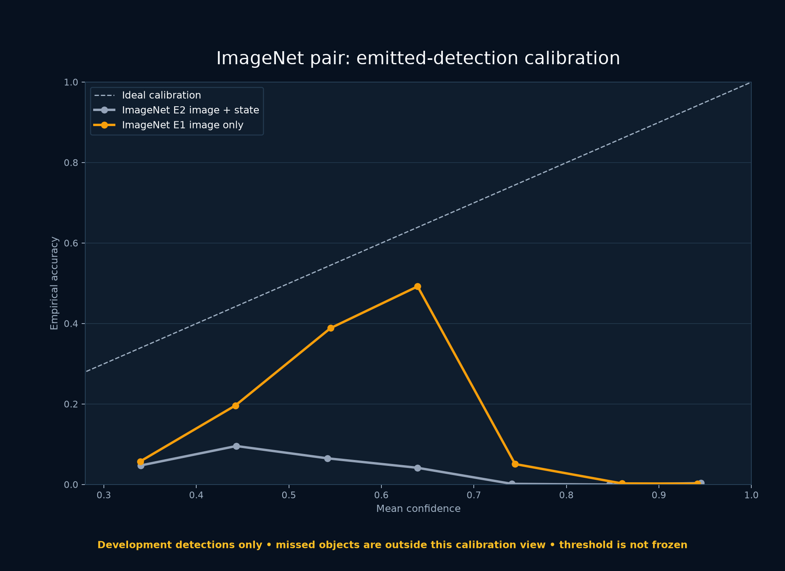

# AeroGuard

**AeroGuard is a flight-aware UAV perception and review console.** It tests a narrow, falsifiable question: on held-out AU-AIR recording sessions, does correctly paired flight state improve aerial object detection over the same RGB detector? The product exposes detections, metadata availability, provenance, failure flags, and operator reviews without claiming autonomous-flight safety.

AeroGuard combines a TorchVision FCOS detector with gated FiLM conditioning so the model can use drone height, speed, and orientation when those values are available. A FastAPI evidence service and React/TypeScript console make every result inspectable by a human reviewer. The system is designed for supervised offline review, with explicit provenance and a safe missing-state path rather than autonomous flight control.

## What works in this repository

- Leakage-safe AU-AIR parsing, state conversion, grouped protocol, and FiLM components with tests.
- A strict [FastAPI backend](docs/BACKEND_API.md) for health, capability discovery, model reports, inference/replay, and idempotent human review.
- A responsive React review console that can start from bundled fixtures and connect to the API.
- A documented [ONNX/TensorRT edge deployment stack](deployment/tensorrt/README.md) with export, engine-build, validation, and inference scripts.
- Reproducible Kaggle scripts for protocol construction, matched training, evaluation, and artifact capture.
- A dual-T4 Lightning gate that ran matched E1 image-only and E2 paired-state arms from one hashed initialization and image schedule.
- A deterministic evaluator for AP50, AP50:95, per-class support, per-root results, fixed-point recall, calibration, and VisDrone ignore regions.
- Judge-ready [Review 1 materials](docs/REVIEW1_OVERVIEW.md), [Review 2 evidence](docs/REVIEW2_EVIDENCE.md), [frozen-visual adapter follow-up](docs/REVIEW2_ADAPTER_FOLLOWUP.md), [final Review 2 deck](docs/final-review2/AeroGuard_Review2_Final_Deck.pptx), [team presentation script](docs/final-review2/REVIEW2_FINAL_PRESENTATION_SCRIPT.md), [Review 1 to Review 2 comparison](docs/final-review2/REVIEW1_TO_REVIEW2.md), [judge Q&A](docs/final-review2/JUDGE_QA.md), [system architecture](docs/assets/aeroguard-review1-architecture.png), and [E2/E1 model architecture](docs/assets/aeroguard-model-architecture.png).

Training and benchmark values appear only after a run writes machine-generated result artifacts. Missing values remain unavailable; the UI never substitutes invented metrics.

## Measured engineering evidence

- AU-AIR manifest: 32,823 frames, 131,977 valid boxes, 54 rejected nonpositive boxes.
- Random-init FCOS overfit gate: loss 2.87 to 1.28 over 24 updates on one real frame.
- Matched Lightning gate: 40 updates per arm, concurrently on physical T4 GPUs 0 and 1, with the same warmstart and eight-frame schedule hashes.
- Image-only E1 kept FiLM projections at exactly zero; paired-state E2 moved their L1 norm from 0 to 120.735.
- Matched random-control and ImageNet-backbone development-training pairs each completed 5,000 updates per arm on physical T4 GPUs 0 and 1. Their saved reports remain training evidence, not held-out accuracy.
- On the frozen development root, the matched ImageNet E2 flight-state arm reached AP50 0.0692 and AP50:95 0.0234 versus image-only E1 at 0.0120 and 0.0024. This supports E2 on development only; the final test remains sealed.
- The Review 2 pair completed one full pass over all 18,523 training frames per arm. Every optimizer-step loss is stored and hashed, both arms use the same frame order and ImageNet warmstart, and physical GPUs 0 and 1 ran concurrently.
- On the same held-out development flight after the full pass, image-plus-state E2 reached AP50 0.1698, best F1 0.4503, and detection accuracy 0.2906. Image-only E1 reached AP50 0.1146, best F1 0.2515, and detection accuracy 0.1438.
- The corrective E3/E4 runs froze and byte-verified every E2 visual tensor while training only the FiLM adapter for 18,523 steps. E4 with 50% state dropout nearly matched E2 at AP50 0.1697, F1 0.4493, and detection accuracy 0.2897, but did not beat it. E2 therefore remains the development-selected model.

The smoke and 40-step runs are implementation gates. The separate [development results](docs/DEVELOPMENT_RESULTS.md) are real held-out development evidence, not final-test or safety evidence.

## Training and development graphs






















The Review 2 plots are generated from complete, committed 18,523-step histories by `python scripts/generate_review2_graphs.py`. Older Review 1 plots remain for traceability and only claim what their earlier artifacts support.


## Quick start

```powershell
python -m pip install -e ".[dev]"
python -m pytest
python scripts/generate_evaluation_fixture.py
python -m uvicorn aeroguard.api.app:app --host 127.0.0.1 --port 8000
```

In another terminal:

```powershell
cd frontend
npm install
npm run dev
```

Open the printed local URL. The bundled demonstration is explicitly labeled `FIXTURE`. Set `VITE_API_URL=http://127.0.0.1:8000` to use the local service.

## Scientific contract

- AU-AIR labels are mapped from source IDs `0..7` to model IDs `1..8`; model ID `0` is background.
- Altitude is converted from millimetres to metres; velocities remain signed m/s; angles remain radians.
- All `_x_` and `_xx_` streams sharing a 14-digit recording root stay in the same partition.
- GPS, filename, absolute time, stream ID, and platform identity are forbidden model features.
- State normalization is fitted on training roots only.
- VisDrone is an external RGB/missing-state test; no telemetry is invented.
- Cached replay is not an inference-speed measurement.

## Repository map

- `src/aeroguard/data`: source parsing, manifests, splits, normalization.
- `src/aeroguard/models`: conditioning components and detector adapter.
- `src/aeroguard/training`: smoke and matched-training orchestration.
- `src/aeroguard/evaluation`: protocol-aware metrics and reports.
- `src/aeroguard/api`, `src/aeroguard/inference`: service and runtime contract.
- `frontend`: operator review console.
- `deployment/tensorrt`: reproducible ONNX/TensorRT edge-inference contract and tooling.
- `configs`: resolved experiment settings.
- `docs`: architecture, model/data cards, Review 1 materials, and measured development evidence.

## Current limitations

- Development metrics guide model selection only. The frozen-visual adapter follow-up is complete and did not beat E2; the release threshold and final-test metrics remain deliberately unfrozen and sealed.
- The checked-in evaluation fixture proves software behavior only; it is not model performance.
- AU-AIR provides paired annotation metadata, not proven zero-latency sensor timestamps.
- With eight recording roots, evaluation is session-held-out but not broad new-location validation.
- Supplied AU-AIR frames do not validate genuinely empty-scene behavior.
- This prototype is for supervised offline perception review, not certified autonomous control.
- TensorRT scripts are implemented and CPU-tested; no `.engine` is claimed until a checkpoint is exported and validated on the target NVIDIA device.
