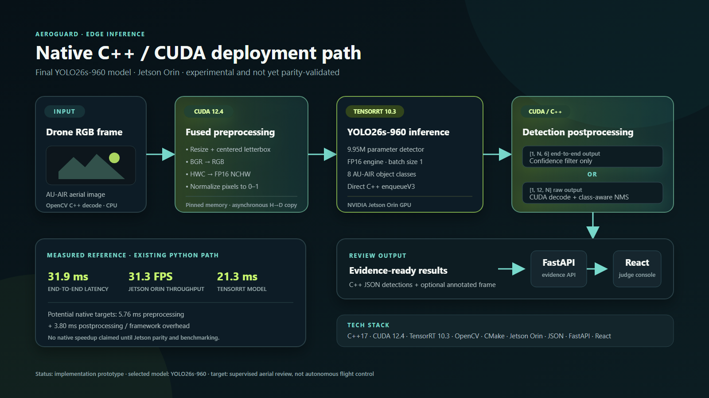

# AeroGuard native CUDA/TensorRT edge prototype

This directory is an **experimental, unvalidated** C++/CUDA inference path for the
final AeroGuard YOLO26s-960 TensorRT engine. It is intentionally separate from the
validated Python benchmark path. Its purpose is to remove Python from the intended
Jetson deployment loop and make the GPU boundary explicit.



An editable vector version is available in
[`docs/assets/aeroguard-native-cuda-architecture.svg`](../../docs/assets/aeroguard-native-cuda-architecture.svg).

## Implemented

- TensorRT 10 named-I/O engine loading and `enqueueV3` execution.
- Support for both plain TensorRT plans and Ultralytics metadata-prefixed `.engine` files.
- Fused CUDA letterbox resize, BGR-to-RGB conversion, HWC-to-NCHW conversion, and
  FP32/FP16 normalization.
- YOLO26 end-to-end output `[1, N, 6]` with confidence filtering.
- Raw YOLO output `[1, 12, N]` or `[1, N, 12]` for eight AU-AIR classes.
- CUDA candidate decoding, GPU confidence sorting, and class-aware CUDA NMS masks
  for raw outputs.
- JSON detections, optional annotated images, and CUDA-event stage timings.

The runner deliberately rejects unknown input/output contracts. It does not silently
reinterpret an engine and produce plausible-looking but invalid boxes.

## Jetson build

Use the compiler, CUDA, and TensorRT installation supplied by the same JetPack release
that produced the engine:

```bash
cd deployment/native
cmake -S . -B build -DCMAKE_BUILD_TYPE=Release
cmake --build build --parallel
```

OpenCV development headers are required (`libopencv-dev` on Jetson Ubuntu). CMake
locates TensorRT in the standard JetPack AArch64 directories.

## Example

```bash
./deployment/native/build/aeroguard_native \
  --engine models/AeroGuard_YOLO26s_960_JetsonOrinNano_TRT10.3_FP16.engine \
  --image docs/assets/auair-demo/frame_20190905091750_x_0000133.jpg \
  --conf 0.25 \
  --output build/native_prediction.json \
  --annotated build/native_prediction.jpg
```

The JSON contains `validation_status: experimental_unvalidated`. Keep that label until
native/Python box parity and repeated Jetson latency measurements have been completed.

## Output contracts

The final YOLO26 export may expose one of two single-output contracts:

| Shape | Interpretation | Native action |
|---|---|---|
| `[1, N, 6]` | NMS-free/end-to-end `xyxy, confidence, class` | confidence filtering only |
| `[1, 12, N]` or `[1, N, 12]` | `xywh` plus eight class scores | CUDA decode and class-aware NMS |

Engines with multiple outputs, additional inputs, unsupported dtypes, or a different
class count fail with a clear message. This prototype targets the selected eight-class
AU-AIR model, not the older FCOS-plus-flight-state research branch.

## Honest status

The repository's existing Python/Ultralytics TensorRT benchmark remains the measured
reference: approximately 31.9 ms end-to-end and 31.3 FPS on the recorded Jetson Orin
run. No speedup is claimed for this native prototype until it is built and measured on
the target device.
