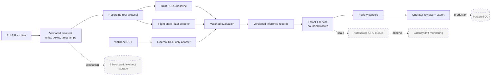

# AeroGuard architecture

Solid nodes are implemented in this repository. Dashed nodes are production-scale extensions and are not claimed as complete.

## Failure boundaries

- Invalid or non-finite state is sanitized before encoding and visibly marked degraded.
- A missing state gate bypasses the FiLM transform; deployment may instead select the separately validated RGB model.
- Inference errors return errors, never plausible dummy detections.
- Fixture and cached records are visibly labeled and have null inference latency.
- Raw archives remain outside the repository; protocol, normalization, config, hashes, and measured results are versioned.
- The evaluator is implemented independently of Torch and fails closed on non-finite boxes/scores, sealed final-test access, or benchmark claims from engineering reports.
- Development checkpoint evaluation is queued after training; final-test evaluation remains blocked by the protocol seal.
