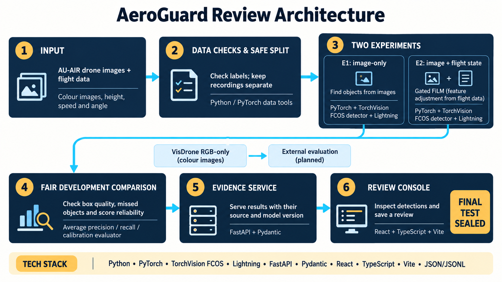

# AeroGuard Review Architecture



Follow stages 1–3 across the top, then the cyan arrow to stages 4–6 across the bottom. Each card gives its purpose and the tools used. This is the intended data flow, not a claim that every evaluation or deployment step has finished. The final test is sealed; no final-test metrics are available.

| Box | What it means |
|---|---|
| 1. Input | AU-AIR supplies colour drone images paired with height, velocity and orientation. The data card records 32,823 frames and eight object classes. Pairing does not prove zero sensor delay. |
| 2. Data checks & safe split | Python checks units, labels, boxes and image identity; PyTorch data tools feed samples to training. Invalid boxes are rejected and logged. Related streams stay in the same recording group: five groups train, one develops the model, two remain sealed. This prevents nearby frames from leaking across partitions. “Safe split” means protection against data leakage, not flight safety. State scaling uses training data only. |
| 3. E1: image-only | PyTorch and TorchVision FCOS predict object boxes, classes and scores from images. FCOS is the object detector; its ResNet-50 backbone and feature pyramid find image patterns at several scales. Flight state is masked. Lightning manages training and checkpoints. |
| 3. E2: image + flight state | The same tools add gated FiLM: feature adjustment from flight data. FiLM formally means feature-wise linear modulation. A small network scales and shifts image features using flight state. The gate disables this adjustment when state is absent; invalid values are cleaned before encoding. Lightning manages this training run too. |
| 4. Fair development comparison | Compare both trained models on the same development data, after matching their starting weights, training budget and image order. The ImageNet E2 arm reached AP50 0.0692 versus E1 at 0.0120 on the single development recording. This is development evidence, not a final-test or safety claim. |
| 5. Evidence service | FastAPI serves results with their model version and input source. Pydantic checks request and record formats. The API is the interface through which the console requests data. JSON stores structured evidence; JSONL stores one review record per line. |
| 6. Review console | React and TypeScript build the screen; Vite builds and serves the frontend. Users inspect detections, input status and evidence, then save or export a review. Fixture and cached modes are labelled. A release checkpoint/runtime still needs local integration. |
| VisDrone RGB-only → external evaluation (planned) | A separate external test with state unavailable. The seven-concept class mapping and ignore policy are implemented; a completed external model evaluation is not claimed. |

The parallel branches represent a fair experiment. They do not combine their predictions. The completed random-control pair used separate physical Tesla T4 GPUs 0 and 1 through Lightning, with 5,000 updates per arm and 18,523 available training records. The matching schedule hash is `f265ee838760d82fdb1816b014b7ce6d10dc87ac7da22dafdd0da3502d205e6d`.

The [ImageNet E1](../reports/development_imagenet_e1_summary.json) and [ImageNet E2](../reports/development_imagenet_e2_summary.json) reports record 5,000 completed updates each. Their shared weights use an ImageNet ResNet-50 backbone, a seeded random nine-label AU-AIR head (including background), and identity-initialized FiLM. Training loss is not accuracy evidence. Missing-state E2 is also not guaranteed to match independently trained E1.

The completed [development comparison](DEVELOPMENT_RESULTS.md) supports E2 as the leading checkpoint on one recording root. It does not freeze the missing-state fallback or score threshold, and the final test remains sealed.

Production extensions are kept out of this simple diagram. The existing architecture proposes object storage, PostgreSQL, a scaled GPU queue and monitoring. They are future work, not current services. The prototype is for supervised review; it makes no autonomous-flight safety claim.

Sources: [architecture](ARCHITECTURE.md), [data card](DATA_CARD.md), [model card](MODEL_CARD.md), [README](../README.md), [config](../configs/development_training.yaml), [E1 report](../reports/development_random_e1_summary.json), [E2 report](../reports/development_random_e2_summary.json), and [ImageNet origin](../reports/shared_imagenet_warmstart_summary.json). No final-test results or submission steps are inferred.

## Image generation record

Mode: built-in `image_gen`, new-image generation replacing the earlier diagram, one asset. The selected output was copied from the tool's `generated_images` directory into `docs/assets/aeroguard-review1-architecture.png` and inspected with `view_image` at original resolution. The original generated output was retained. Native size: 1672 × 941 pixels; aspect ratio 1.77683:1, approximately 16:9 (not mathematically exact). No resizing or cropping was applied. The bottom TECH STACK strip lists the current tools; it does not imply a completed production deployment.

Exact final prompt:

```text
Use case: infographic-diagram
Asset type: beginner-friendly 16:9 landscape architecture slide, 1920 x 1080.
Create a replacement diagram titled exactly "AeroGuard Review Architecture". Off-white background, dark navy cards, cyan arrows, restrained amber accents, large readable sans-serif type, generous whitespace. No logos, watermark, decorative drones, tiny text, performance numbers or completion claims.
Use six numbered stages in a spacious two-row reading flow: top row stages 1, 2, 3 left-to-right; a clear arrow from 3 down to stage 4 at lower left; lower row 4, 5, 6 left-to-right. Avoid crossing arrows. Stage 3 contains two equal parallel branch cards; both feed stage 4. Make purpose text as readable as technology text. Render these exact labels, allowing line breaks:
1 INPUT
AU-AIR drone images + flight data
Colour images, height, speed and angle
2 DATA CHECKS & SAFE SPLIT
Check labels; keep recordings separate
Python / PyTorch data tools
3 TWO EXPERIMENTS
E1: image-only
Find objects from images
PyTorch + TorchVision FCOS detector + Lightning
E2: image + flight state
Gated FiLM (feature adjustment from flight data)
PyTorch + TorchVision FCOS detector + Lightning
4 FAIR DEVELOPMENT COMPARISON
Check box quality, missed objects and score reliability
Average precision / recall / calibration evaluator
5 EVIDENCE SERVICE
Serve results with their source and model version
FastAPI + Pydantic
6 REVIEW CONSOLE
Inspect detections and save a review
React + TypeScript + Vite
Add a small separate side path above the bottom strip: "VisDrone RGB-only (colour images)" -> "External evaluation (planned)".
Retain a clearly visible amber badge "FINAL TEST SEALED".
Add one compact bottom strip titled "TECH STACK" containing exactly: "Python • PyTorch • TorchVision FCOS • Lightning • FastAPI • Pydantic • React • TypeScript • Vite • JSON/JSONL".
Keep the diagram clean and simple with no extra nodes or text. The main flow is input -> checks -> two parallel experiments -> fair development comparison -> evidence service -> review console.
```
