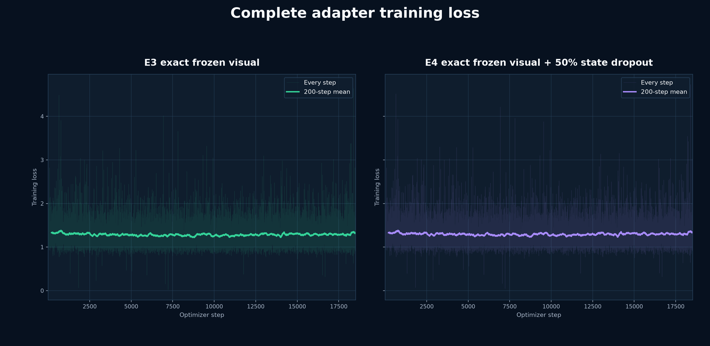
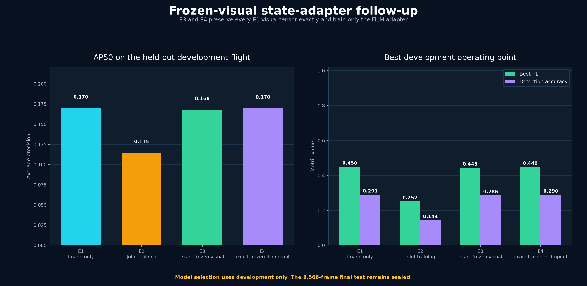

# AeroGuard frozen-visual adapter follow-up

This experiment responds to the full-pass E2 failure mode. E3 and E4 start from the stronger E1 checkpoint. Every visual-detector tensor is frozen and verified byte-for-byte after training; only the residual FiLM adapter changes.

## Adapter training

| Arm | Steps | Mean active-state mask | First-200 loss | Last-200 loss | Time |
|---|---:|---:|---:|---:|---:|
| E3 exact frozen visual | 18,523 | 1.000 | 1.3292 | 1.3280 | 34.7 min |
| E4 exact frozen visual + 50% state dropout | 18,523 | 0.502 | 1.3294 | 1.3420 | 34.7 min |

## Held-out development comparison

| Model | AP50 | AP50:95 | Threshold | Precision | Recall | F1 | Detection accuracy |
|---|---:|---:|---:|---:|---:|---:|---:|
| E1 image only | 0.1698 | 0.0665 | 0.45 | 0.5257 | 0.3939 | 0.4503 | 0.2906 |
| E2 joint training | 0.1146 | 0.0445 | 0.45 | 0.2220 | 0.2900 | 0.2515 | 0.1438 |
| E3 exact frozen visual | 0.1679 | 0.0657 | 0.45 | 0.5451 | 0.3753 | 0.4446 | 0.2858 |
| E4 exact frozen + dropout | 0.1697 | 0.0665 | 0.45 | 0.5405 | 0.3844 | 0.4493 | 0.2897 |

**Decision:** The highest development AP50 remains E1 image only at 0.1698.

Detection accuracy is `TP / (TP + FP + FN)`. These are development-only results. The final test remains sealed.
