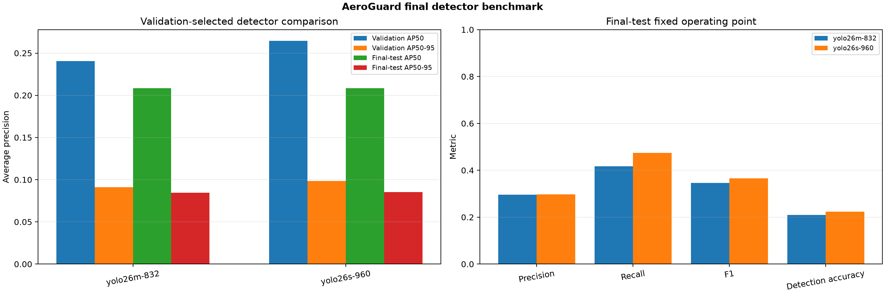

# Final benchmark evidence

This directory contains the machine-readable evidence for AeroGuard's final AU-AIR experiments. Metrics are generated from saved checkpoints and source annotations; they are not copied from console text or entered by hand.

## Leakage-safe data split

| Partition | Complete flight recordings | Frames | Share |
|---|---:|---:|---:|
| Training | 6 | 28,281 | 86.16% |
| Validation | 1 | 2,962 | 9.02% |
| Final test | 1 | 1,580 | 4.81% |
| Total | 8 | 32,823 | 100% |

Every frame from the same 14-digit recording root stays in one partition. The validation and test flights therefore cannot leak neighboring video frames into training.

## Reported values

- Training loss and validation loss are recorded after every epoch, including box, class, and localization components plus their total.
- Precision, recall, F1, detection accuracy, AP50, and AP50–95 are recorded for every epoch.
- Final-test loss is measured once on a newly constructed test dataloader after the checkpoint is locked.
- The final confidence threshold is selected on validation data and then frozen for final-test TP, FP, FN, precision, recall, F1, and detection accuracy.
- Per-class metrics, confusion matrices, raw histories, model configuration, and checkpoint identity are retained.

For object detection, `detection accuracy` means `TP / (TP + FP + FN)`. It is not image-classification accuracy. AP50 measures the area under the precision-recall curve when a predicted box overlaps the correct box by at least 50%; AP50–95 averages stricter overlap thresholds from 50% through 95%.

## Final result

The winner was selected only from the validation flight. **YOLO26s at 960 px** won with validation AP50 **0.2646** and AP50–95 **0.0983**, ahead of YOLO26m at 832 px (**0.2405**, **0.0909**).

| Frozen final-test metric | YOLO26m 832 | YOLO26s 960 — selected |
|---|---:|---:|
| AP50 | 0.2084 | 0.2083 |
| AP50–95 | 0.0844 | **0.0852** |
| Precision at frozen threshold | 0.2962 | **0.2969** |
| Recall at frozen threshold | 0.4178 | **0.4741** |
| F1 at frozen threshold | 0.3467 | **0.3651** |
| Detection accuracy | 0.2097 | **0.2233** |
| True positives | 3,219 | **3,640** |
| False positives | **7,647** | 8,621 |
| False negatives | 4,486 | **4,038** |
| Total detector loss | 4.4226 | **4.2918** |

The selected model uses 9.95 million parameters and is stored at `models/AeroGuard_YOLO26s_960.pt`. The larger model is slightly more conservative and produces fewer false positives, while the selected model recovers 421 more true objects and misses 448 fewer objects on the final flight.

An optional epoch-6 test-time-augmentation check improved AP50 from 0.1958 to 0.1992 and AP50–95 from 0.0793 to 0.0826 on the same checkpoint. TTA increased T4 inference from 11.4 ms to 27.1 ms per image, so it is reported as an offline accuracy mode rather than the TensorRT edge default.

## Experiment branches

- `state-hypothesis/` contains the matched image-only versus image-plus-flight-state smoke test. It did not pass its predeclared promotion gate, so no large state-conditioned run or final-test evaluation was launched for that branch.
- The detector benchmark folders contain the complete train/validation/test evidence for the pretrained candidate models. Candidate selection uses validation AP50–95, with AP50 as the tie-breaker; final-test values are not used to select the winner.
