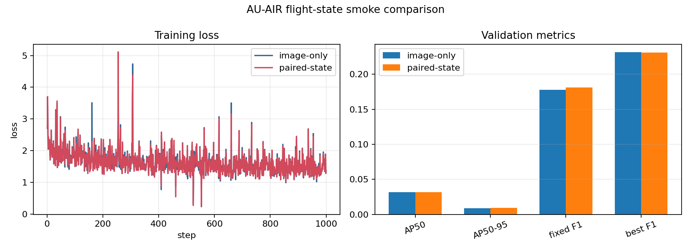

# Flight-state hypothesis smoke test

This experiment asks whether correctly paired drone flight state improves detection over the same image-only detector. Both arms used the same ImageNet-initialized ResNet-50/FCOS warm start, seed, image order, 1,000 optimizer steps, and held-out validation recording. The only intended difference was whether the FiLM adapter received real flight state or masked state.

## Result

| Validation metric | Image only | Image + flight state | Change |
|---|---:|---:|---:|
| AP50 | 0.03149 | 0.03177 | +0.00028 |
| AP50–95 | 0.00906 | 0.00919 | +0.00013 |
| Fixed-threshold F1 | 0.17752 | 0.18095 | +1.94% relative |
| Best F1 | 0.23128 | 0.23106 | -0.00022 |
| False positives | 43,224 | 40,903 | -2,321 |

The paired-state arm reduced false positives and slightly improved fixed-threshold F1, but it did not meet the predeclared promotion rule of at least +0.01 AP50 or +3% relative F1 without worse false alarms. We therefore did not spend a full-scale run on this branch and did not open the final-test recording for this hypothesis.

## Evidence files

- `state_hypothesis_comparison.json`: comparison, deltas, split, and promotion decision.
- `seed17_gate.json`: machine-readable gate result.
- `image_only_evaluation.json`, `paired_state_evaluation.json`: full validation reports.
- `image_only_loss_history.jsonl`, `paired_state_loss_history.jsonl`: all 1,000 logged training steps for each arm.

This is a smoke-test conclusion, not a claim that telemetry can never help. It means this particular short run did not provide enough evidence to justify the larger experiment before the final benchmark.
